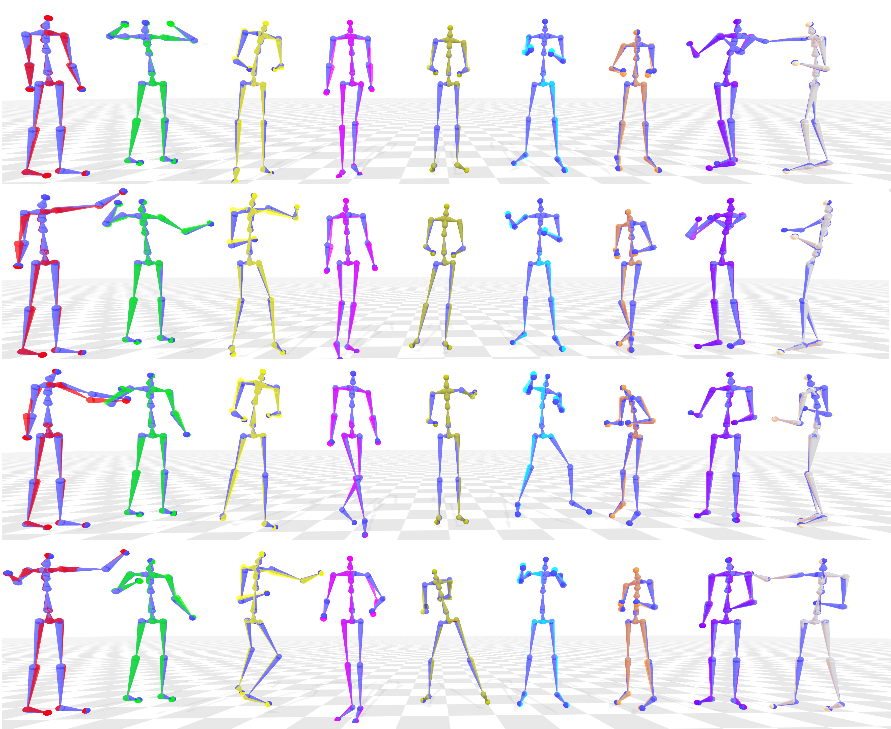
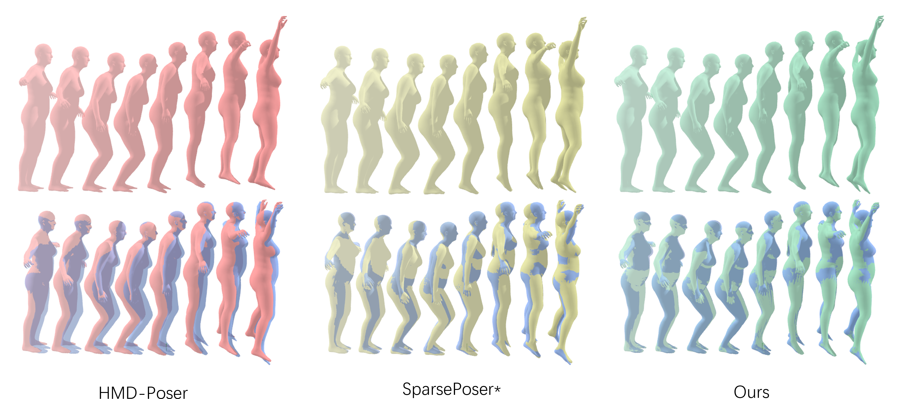

# SSR-HMR: Skeleton-Aware Sparse Node-Based Real-Time Human Motion Reconstruction

The code for this project is currently in a pre-release state and will be publicly available upon the formal acceptance of the associated paper in the journal. We are committed to adhering to the open-source spirit of the academic community and ensuring the integrity and reproducibility of the code.

**SSR-HMR** is a real-time human motion reconstruction system based on sparse nodes and skeleton perception. The system can efficiently reconstruct human movement from sparse sensor data, which is suitable for virtual reality (VR), augmented reality (AR), motion capture and other fields.



Pose reconstruction for users with different body proportions. Each row corresponds to a different action, and each column represents a different user. Different users are visually distinguished, while the blue trajectories represent the real motion capture data from the dataset

Qualitative comparison of the jumping jack motion sequence reconstructed by different models. The first row shows the visual results of the motion reconstruction for each model, while the second row compares the reconstruction results with the real human motion (represented in blue).

## Demo Video


## Highlights
- Novel SSR-HMR method for real-time, accurate full-body motion reconstruction.
- Lightweight spatiotemporal graph module for precise motion from sparse inputs.
- Torso pose refinement module reduces torso and head orientation drift.
- Hierarchical skeletal structure enhances end-effector positioning accuracy.
- Sub-centimeter accuracy (MPJPE 10 mm, MPEEPE 5 mm) at 267 FPS on CPU

## 快速开始

### 安装依赖

确保你已经安装了以下依赖：

- Python 3.8+
- PyTorch 1.10+
- numpy==1.25.1
- upc-pymotion==0.1.8

### 运行示例

1. 克隆本仓库：

```bash
git clone https://github.com/Lucifer-G0/SSR-HMR.git
cd SSR-HMR
```

2. 运行示例代码：

```bash
python demo.py
```

### Dataset

Download different datasets from the following list as needed.

- [dataset](https://zenodo.org/record/8427980/files/data.zip?download=1) for Xsens from [SparsePoser ](https://github.com/UPC-ViRVIG/SparsePoser)

- dataset from [AMASS](https://amass.is.tue.mpg.de/index.html)
  - DanceDB
  - HUMAN4D
  - SOMA
  - others

## 项目结构

```
SSR-HMR/
├── data/                # 数据集
├── models/              # 预训练模型
├── net/               # 模型定义\工具函数
├── train.py              # 示例代码
├── eval.py              # 示例代码
├── requirements.txt     # 依赖列表
├── LICENSE              # 许可证
└── README.md            # 项目介绍
```


## 引用

如果你在研究中使用了本项目，请引用以下文献：

```bibtex
@article{yourpaper,
  title={SSR-HMR: Skeleton-Aware Sparse Node-Based Real-Time Human Motion Reconstruction},
  author={Linhai Li, Co-authors},
  journal={Journal Name},
  year={2025}
}
```

## 联系方式

如有任何问题，请联系：[linhai.student@foxmail.com](mailto:linhai.student@foxmail.com)

